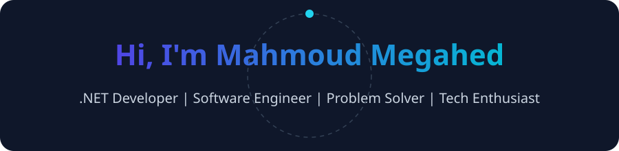

## 👋 About Me
- 🎓 Bachelor of Computers & AI – Damietta University (2023 – 2027)
- 💻 Backend-focused: C#, ASP.NET Core, SQL Server, EF Core, Clean Architecture
- 🧠 Competitive Programmer & Problem Solver (Advanced Data Structures & Algorithms)
- 🏆 ECPC Finalist (Egyptian Collegiate Programming Contest)
- 💼 Full Stack .NET Intern @ DEPI (2025 – 2026)
- 🌐 Live Portfolio: [portfolio-mahmoudmegahed.vercel.app](https://portfolio-mahmoudmegahed.vercel.app/)

## 🚀 Featured Project

### 🎮 [Arcade Electronics — E-Commerce Platform](https://github.com/Mahmoud-Megahed1/Arcade-Electronics)
A modern, feature-rich enterprise e-commerce platform for gaming & electronics built with **ASP.NET Core (.NET 10.0)**, **Entity Framework Core**, and **SQL Server**.
- **Core Capabilities:** Real-time Shopping Cart, Order Lifecycle Tracking, Dual Theme (Cyberpunk Light/Dark), Comprehensive Admin Panel (Inventory, Reports, Shipping).
- **Architecture:** Layered Architecture, Repository Pattern, ASP.NET Core Identity Authentication & Authorization, Seeded Migrations.

## 🧰 Toolbox

## 📡 Focus Areas
- Clean Architecture • CQRS • async/await • REST APIs • Redis Caching • Serilog • CI/CD
- SQL Performance • Indexes • Query Tuning • Transactions • Execution Plans

## 📊 GitHub Overview  

| ⚡ GitHub Stats | 🔥 Streak Stats |
|-----------------|----------------|
|  |  |

---

## 📈 Contribution Graph  

## 📬 Connect with Me  

<!-- Bonus banners -->

